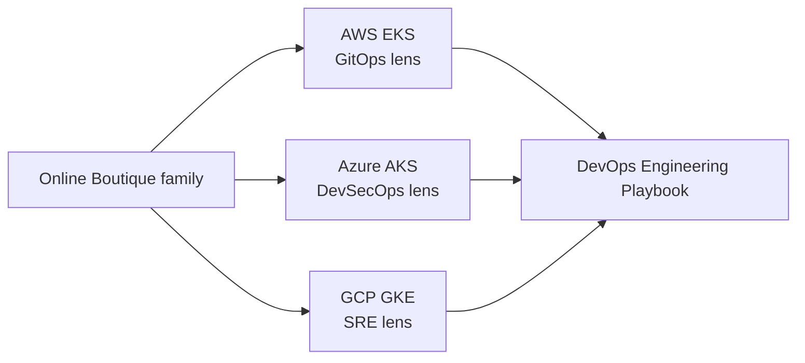

# Architecture Gallery

Reference architectures for the boutique platforms — **same design language**, different engineering lens.

| Cloud | Lens | Document | Hard rule |
|-------|------|----------|-----------|
| AWS | GitOps | [aws-eks-gitops.md](./aws-eks-gitops.md) | CI never deploys |
| Azure | DevSecOps | [azure-aks-devsecops.md](./azure-aks-devsecops.md) | Unsigned images do not run |
| GCP | SRE | [gcp-gke-sre.md](./gcp-gke-sre.md) | Deployed ≠ reliable |

## Multi-cloud map

Cloud is the implementation. Engineering is the story.

## How to read each note

Every platform page includes:

1. Context + hard rule  
2. Delivery / control-plane diagram (Mermaid — renders on GitHub)  
3. Environment model  
4. Security or reliability callout  
5. Links to deep docs in the upstream repo  

Rendered PNG thumbnails can be added later under `architecture/assets/` without changing this structure.
