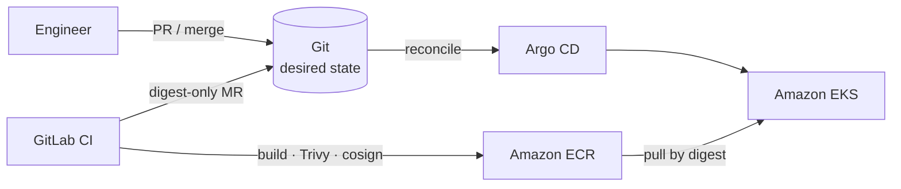
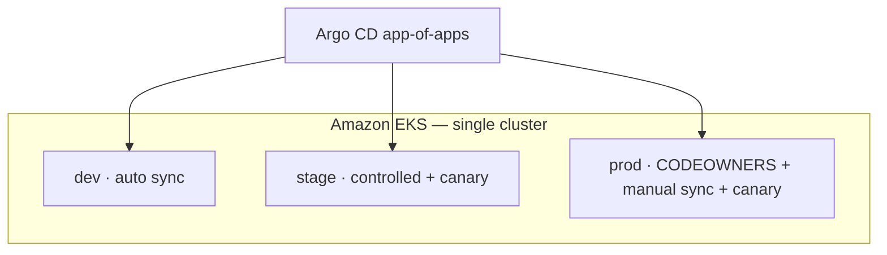

# Architecture: AWS EKS GitOps

**Project:** [boutique-eks-gitops](https://github.com/btilki/boutique-eks-gitops)  
**Lens:** GitOps · digest-only delivery  
**Hard rule:** **CI never deploys** — pipelines open digest MRs; Argo CD reconciles from Git.

## Context

Production-inspired GitOps on a single Amazon EKS cluster (`eu-central-1` when live). Engineers change what runs by merging Git — primarily image **digest** pins. GitLab CI builds, scans, and signs; it does not `kubectl apply` or `argocd sync` for routine releases.

## Delivery control plane

## Environments (one cluster)

Logical `prod` ≠ multi-account HA. Cost and blast radius are explicit tradeoffs (see upstream ADRs).

## Platform baseline (summary)

| Layer | Choices |
|-------|---------|
| IaC | Terraform — VPC, EKS, ECR, OIDC/IRSA |
| GitOps | Argo CD — app-of-apps + ApplicationSet |
| Delivery | Argo Rollouts canary (ALB) without requiring a service mesh |
| Policy | Kyverno digest / ECR allowlist |
| Secrets | External Secrets Operator |
| Observability | Prometheus, Loki, Grafana, Alertmanager (email) |

## Upstream diagrams & docs

- [README hero diagram](https://github.com/btilki/boutique-eks-gitops#boutique-eks-gitops)
- [docs/ARCHITECTURE.md](https://github.com/btilki/boutique-eks-gitops/blob/main/docs/ARCHITECTURE.md)
- [Deployment flow](https://github.com/btilki/boutique-eks-gitops/blob/main/docs/architecture/05-deployment-flow.md)
- [Component design](https://github.com/btilki/boutique-eks-gitops/blob/main/docs/architecture/03-component-design.md)
- [ADR: digest-only GitOps](https://github.com/btilki/boutique-eks-gitops/blob/main/docs/adr/0001-digest-only-gitops.md)

## Related

- Featured project brief: [../featured-projects/boutique-eks-gitops.md](../featured-projects/boutique-eks-gitops.md)
- Articles: [E1](../articles/E1.md), [E2](../articles/E2.md), [E3](../articles/E3.md)
- Learning Matrix row: GitOps → [../learning-paths/learning-matrix.md](../learning-paths/learning-matrix.md)
