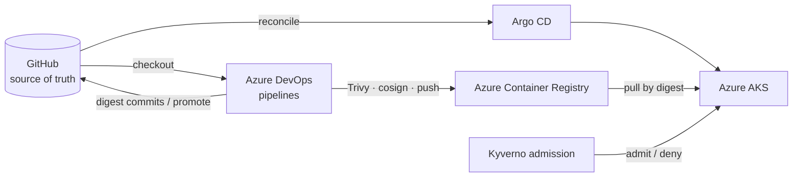
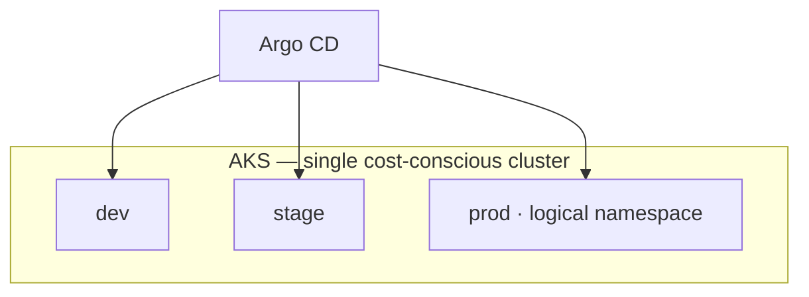

# Architecture: Azure AKS DevSecOps

**Project:** [boutique-aks-devsecops](https://github.com/btilki/boutique-aks-devsecops)  
**Lens:** DevSecOps · supply chain + admission  
**Hard rule:** **Unsigned / non-compliant images should not run** — sign in CI; enforce with Kyverno.

## Context

Production-pilot DevSecOps on Azure Kubernetes Service. **GitHub** is the git source of truth; **Azure DevOps** runs CI via OIDC (no GitHub Actions by design). Digests promote through GitOps; Key Vault backs secrets. Pilot was lived then torn down (including ACR when designed that way).

## CI + GitOps control plane

## Environments (one cluster)

`prod` is a namespace on one cluster — not a separate production estate. Honesty is part of the security posture.

## Security baseline (summary)

| Control | Implementation |
|---------|----------------|
| CI identity | Azure DevOps OIDC to Azure (no long-lived pipeline secrets) |
| Scan / sign | Trivy + cosign |
| Admission | Kyverno — digest / signature intent |
| Secrets | Key Vault integration (no secrets in Git) |
| Tool split | GitHub for Git · ADO for pipelines — deliberate |

## Upstream diagrams & docs

- [README — CI story](https://github.com/btilki/boutique-aks-devsecops#ci-story)
- [ARCHITECTURE.md](https://github.com/btilki/boutique-aks-devsecops/blob/main/ARCHITECTURE.md)
- [Threat model](https://github.com/btilki/boutique-aks-devsecops/blob/main/docs/security/threat-model.md)
- [Supply chain](https://github.com/btilki/boutique-aks-devsecops/blob/main/docs/security/supply-chain.md)
- [Deployment flow](https://github.com/btilki/boutique-aks-devsecops/blob/main/docs/architecture/05-deployment-flow.md)

## Related

- Featured project brief: [../featured-projects/boutique-aks-devsecops.md](../featured-projects/boutique-aks-devsecops.md)
- Articles: [A1](../articles/A1.md), [A2](../articles/A2.md), [A3](../articles/A3.md)
- Learning Matrix row: DevSecOps → [../learning-paths/learning-matrix.md](../learning-paths/learning-matrix.md)
