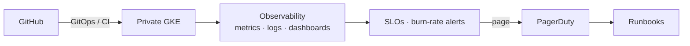
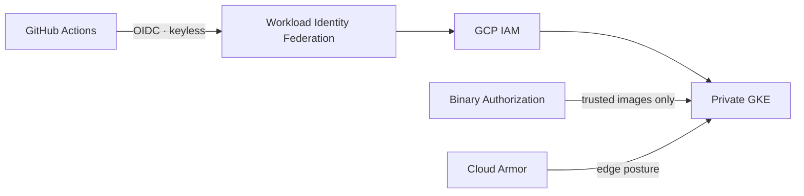

# Architecture: GCP GKE SRE

**Project:** [boutique-gke-sre](https://github.com/btilki/boutique-gke-sre)  
**Lens:** SRE · observability + reliability  
**Hard rule:** **Deployed ≠ reliable** — SLOs, burn-rate alerts, and runbooks required.

## Context

Production-style platform + SRE stack on a **private regional GKE** cluster. GitOps and supply-chain controls are present; the headline is reliability: SLIs/SLOs, burn-rate alerting, PagerDuty, runbooks. Infrastructure was decommissioned after validation — docs and diagrams remain.

## Reliability control plane

## Identity & edge baseline

No long-lived SA JSON keys in CI. Security baseline is part of the reliability story.

## Environments & lifecycle

| Item | State |
|------|--------|
| Cluster model | Single private regional GKE |
| DNS | Inactive until rebuild (by design after teardown) |
| Artifact | Git docs, ADRs, observability config — not warm vanity URLs |

## Upstream diagrams & docs

- [README Mermaid](https://github.com/btilki/boutique-gke-sre#what-this-is)
- [ARCHITECTURE.md](https://github.com/btilki/boutique-gke-sre/blob/main/ARCHITECTURE.md)
- [Architecture overview](https://github.com/btilki/boutique-gke-sre/blob/main/docs/architecture/overview.md)
- [Diagram assets](https://github.com/btilki/boutique-gke-sre/tree/main/assets/diagrams)
- [Operations runbook](https://github.com/btilki/boutique-gke-sre/blob/main/docs/operations/operations-runbook.md)
- [WIF setup](https://github.com/btilki/boutique-gke-sre/blob/main/docs/setup/07-github-wif.md)

## Related

- Featured project brief: [../featured-projects/boutique-gke-sre.md](../featured-projects/boutique-gke-sre.md)
- Articles: [G1](../articles/G1.md), [G2](../articles/G2.md), [G3](../articles/G3.md)
- Learning Matrix row: SRE → [../learning-paths/learning-matrix.md](../learning-paths/learning-matrix.md)
